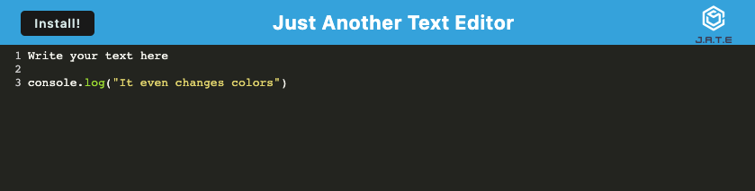

# Text-editor

Title: Text-editor

Developer: Francis Bond

Deployment Date: Mar 10, 2022

For: UT Coding Bootcamp

Published: GitHub and Heroku

Built with: Node.js, Express, Webpack, Service-worker, Javascript, CSS, 

## Summary

This application is a Progressive Web App also known as a pwa. The application allows a user to edit text in their browser. It is installable their system for use without a network connection.

## Development

